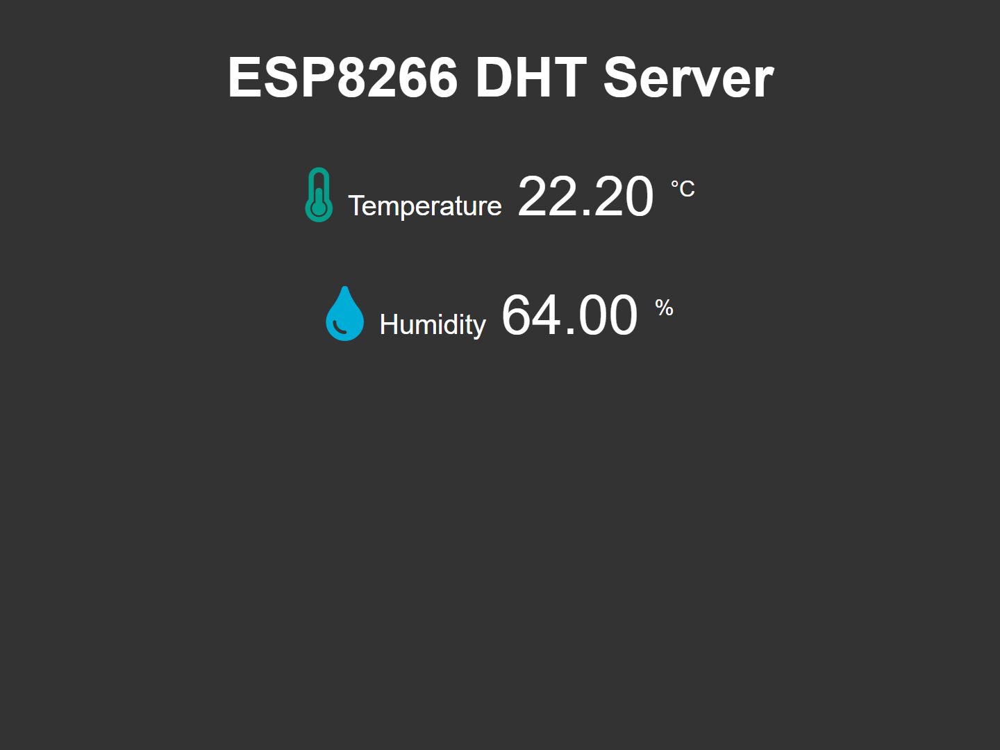
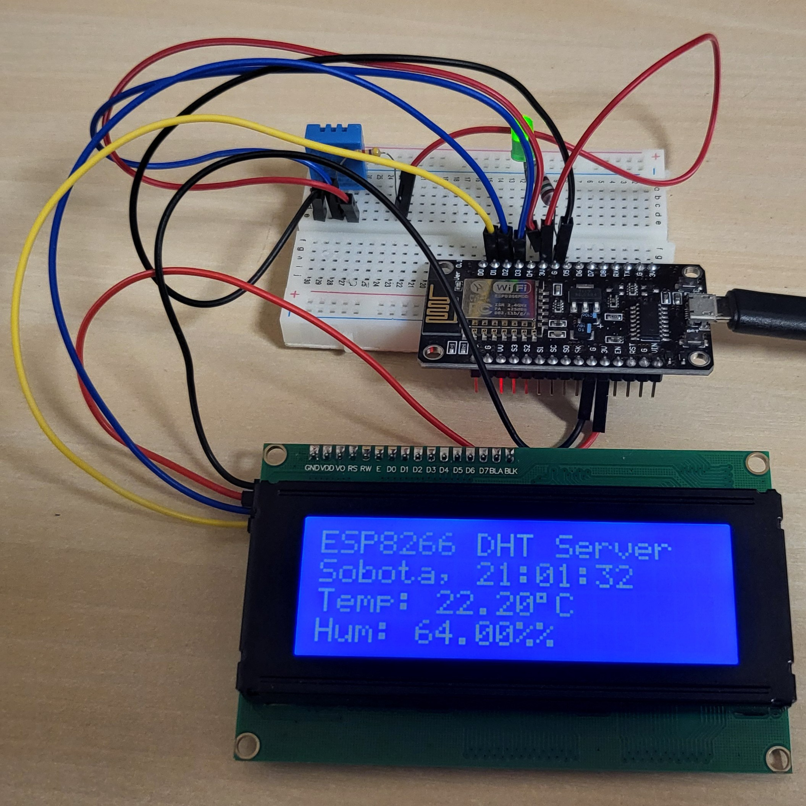

# ESP8266-DHT-Sensor
This project allows you to monitor temperature and humidity using a DHT sensor connected to an ESP8266 microcontroller. The ESP8266 is used to collect data from the DHT sensor and send it wirelessly over Wi-Fi to a web interface or a remote server for logging and monitoring.

    
    

