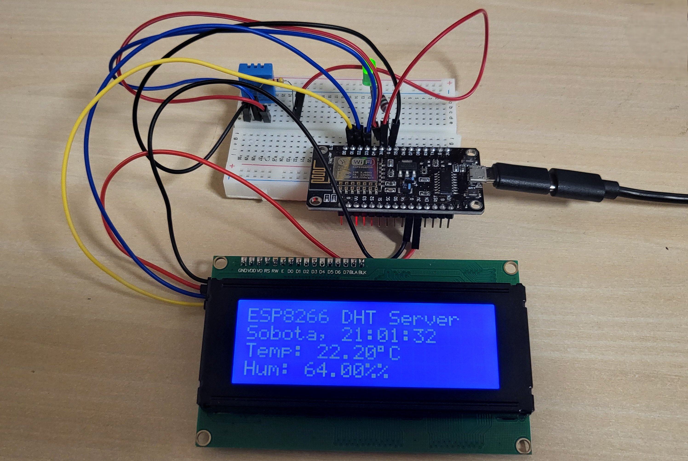

# ESP8266-DHT-Sensor
This project enables wireless monitoring of temperature and humidity using a DHT sensor connected to an ESP8266 microcontroller. The ESP8266 collects real-time data from the DHT sensor and transmits it over Wi-Fi, allowing you to access the data through a web interface using HTML.

## Features
- Real-Time Data Collection: Reads temperature and humidity values from the DHT sensor at regular intervals.
- Wireless Transmission: Uses Wi-Fi to send data to a web interface or a remote server.
- Remote Monitoring: Access the sensor data on any device connected to the same network or via the internet if configured.

## Web server (via IP Address)
ESP8266 acts as a web server providing the readings from the DHT sensor (e.g., DHT11 or DHT22).

    

## Hardware Requirements (breadboard)
- ESP8266 Microcontroller
- DHT Sensor (e.g., DHT11 or DHT22)
- LCD HD44780 16x2 or 20x4
- I2C apapter for LCD 
- Jumper Wires
- Breadboard (optional)

    

